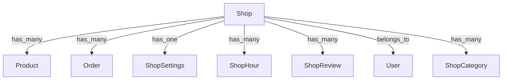

# TODO Backend Shop — Marketify

## 1. État Actuel

Le backend seller est maintenant complet avec toutes les fonctionnalités P0, P1 et P2 implémentées. Il est temps de se concentrer sur l'amélioration et l'extension des fonctionnalités spécifiques aux shops (boutiques).

## 2. Fonctionnalités Shop Existantes

### 2.1 Déjà Implémenté
- [x] Création et gestion basique des shops
- [x] Upload de logo et bannière
- [x] Workflow de soumission et review
- [x] Statut des shops (draft, pending, active, suspended, rejected)
- [x] Intégration avec le seller onboarding

### 2.2 À Améliorer/Étendre

## 3. Roadmap Shop Backend

### 3.1 Gestion Avancée des Shops (P0)

#### [ ] Système de Réputation des Shops
- [ ] Modèle de données pour les avis et notes
- [ ] Calcul automatique de la note moyenne
- [ ] Endpoint pour récupérer la réputation d'un shop
- [ ] Intégration avec les commandes (note après livraison)
- [ ] Modération des avis
- [ ] Affichage des avis dans l'API publique

#### [ ] Gestion des Horaires d'Ouverture
- [ ] Modèle pour les horaires par jour
- [ ] Endpoint CRUD pour les horaires
- [ ] Vérification des horaires dans les commandes
- [ ] Affichage dans l'API publique

#### [ ] Localisation et Livraison
- [ ] Intégration avec une API de géolocalisation
- [ ] Calcul des zones de livraison
- [ ] Estimation des frais de livraison
- [ ] Validation des adresses de livraison

#### [ ] Catalogue et Catégories Avancés
- [ ] Hiérarchie de catégories multi-niveaux
- [ ] Attributs de produits personnalisables
- [ ] Filtres avancés pour les clients
- [ ] Recherche full-text optimisée

### 3.2 Expérience Shop (P1)

#### [ ] Tableau de Bord Shop Amélioré
- [ ] Métriques en temps réel
- [ ] Visualisation des ventes
- [ ] Analytics des produits populaires
- [ ] Alertes et notifications

#### [ ] Promotions et Remises
- [ ] Système de coupons
- [ ] Remises par quantité
- [ ] Promotions saisonnières
- [ ] Gestion des codes promo

#### [ ] Gestion des Retours
- [ ] Workflow de retour complet
- [ ] Remboursements automatisés
- [ ] Suivi des retours
- [ ] Intégration avec l'inventaire

#### [ ] Intégration des Réseaux Sociaux
- [ ] Partage des produits sur les réseaux
- [ ] Authentification sociale
- [ ] Intégration des avis sociaux

### 3.3 Administration et Modération (P1)

#### [ ] Outils de Modération Avancés
- [ ] Signalement des shops
- [ ] Suspension automatique
- [ ] Historique des actions
- [ ] Audit trail complet

#### [ ] Gestion des Fraudes
- [ ] Détection des activités suspectes
- [ ] Vérification des documents
- [ ] Score de confiance
- [ ] Alertes en temps réel

#### [ ] Reporting et Analytics
- [ ] Tableaux de bord admin
- [ ] Export des données
- [ ] Alertes personnalisables
- [ ] Historique complet

### 3.4 Intégrations Externes (P2)

#### [ ] Paiements Avancés
- [ ] Intégration avec plus de providers
- [ ] Paiements récurrents
- [ ] Abonnements
- [ ] Wallet virtuel

#### [ ] Logistique et Fulfillment
- [ ] Intégration avec des partenaires logistiques
- [ ] Suivi des colis en temps réel
- [ ] Gestion des retours logistiques
- [ ] Optimisation des tournées

#### [ ] Marketplace Extensions
- [ ] API pour les partenaires
- [ ] Webhooks pour les événements
- [ ] Documentation complète
- [ ] Sandbox pour les tests

## 4. Architecture Technique

### 4.1 Modèles de Données

### 4.2 API Endpoints

#### Shop Management
- `GET /api/v1/shops/{shop}` - Récupérer un shop
- `PATCH /api/v1/shops/{shop}` - Mettre à jour un shop
- `GET /api/v1/shops/{shop}/reputation` - Récupérer la réputation
- `GET /api/v1/shops/{shop}/hours` - Récupérer les horaires
- `PUT /api/v1/shops/{shop}/hours` - Mettre à jour les horaires

#### Reviews et Ratings
- `GET /api/v1/shops/{shop}/reviews` - Lister les avis
- `POST /api/v1/shops/{shop}/reviews` - Créer un avis
- `GET /api/v1/shops/{shop}/rating` - Récupérer la note moyenne

#### Promotions
- `GET /api/v1/shops/{shop}/promotions` - Lister les promotions
- `POST /api/v1/shops/{shop}/promotions` - Créer une promotion
- `DELETE /api/v1/shops/{shop}/promotions/{promotion}` - Supprimer une promotion

### 4.3 Sécurité

- Validation stricte des données
- Autorisation fine (policies)
- Rate limiting différencié
- Audit trail complet
- Chiffrement des données sensibles

## 5. Priorisation et Estimation

### Phase 1: MVP (4-6 semaines)
- Système de réputation basique
- Horaires d'ouverture
- Localisation et livraison
- Catalogue avancé

### Phase 2: Expérience (3-4 semaines)
- Tableau de bord amélioré
- Promotions et remises
- Gestion des retours
- Intégration réseaux sociaux

### Phase 3: Administration (2-3 semaines)
- Outils de modération
- Gestion des fraudes
- Reporting et analytics

### Phase 4: Intégrations (4-6 semaines)
- Paiements avancés
- Logistique et fulfillment
- Marketplace extensions

## 6. Métriques de Succès

- ⬆️ Taux de conversion des shops
- ⬇️ Taux de fraude
- ⬆️ Satisfaction des vendeurs
- ⬆️ Nombre de commandes par shop
- ⬇️ Temps de traitement des commandes

## 7. Risques et Atténuation

### Risques Techniques
- **Complexité des horaires** : Utiliser une bibliothèque éprouvée
- **Performance des recherches** : Optimiser avec Elasticsearch
- **Synchronisation des données** : Mettre en place des événements

### Risques Métier
- **Adoption par les vendeurs** : Documentation et formation
- **Fraude et abus** : Système de détection précoce
- **Concurrence** : Différenciation par l'expérience

## 8. Dépendances

- Laravel 11
- PHP 8.2+
- MySQL/PostgreSQL
- Redis
- Elasticsearch (pour la recherche)
- API de géolocalisation

## 9. Livrables

1. Code source complet
2. Documentation API
3. Tests automatisés
4. Scripts de déploiement
5. Documentation utilisateur

## 10. Équipe et Rôles

- **Backend Lead** : Architecture et implémentation core
- **Frontend** : Intégration avec l'UI
- **DevOps** : Déploiement et scaling
- **QA** : Tests et assurance qualité
- **Product Owner** : Spécifications et priorisation

---

**Dernière mise à jour** : 2024-06-20
**Statut** : En cours d'implémentation
**Prochaine révision** : 2024-07-01